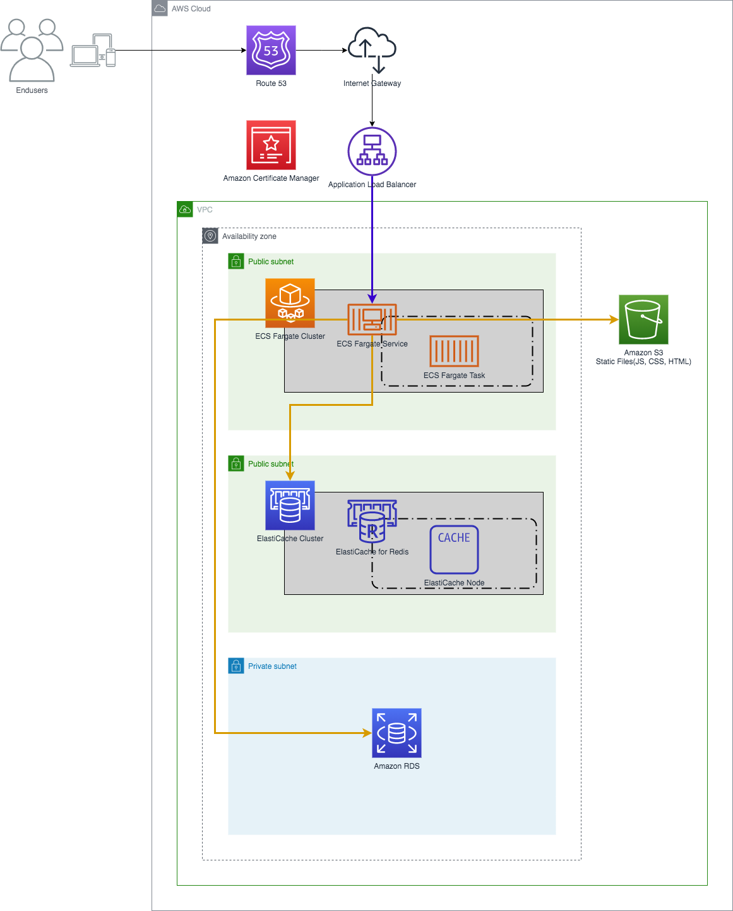

# riflessione-tf
Riflessione AWS環境 - terraform

## About This Document

Describe the procedure for building the Development Environment and various procedures required for Development.

This Terraform project can build the AWS Architecture described later.



# Building Development Environment

- Assuming development with Mac OS X
- Install Docker for Mac
- Clone this repository

```bash
git clone git@github.com:mmmcorp/riflessione-tf.git
cd riflessione-tf
```

- Copy env.sample file, and then rename it `.env` . Enter the required information such as AWS Access Key in `.env` .

```bash
cp env.sample .env
```

## Terraform Commands

### terraform init

```
$ make init
```

### terraform plan

```
$ make plan
```

### terraform show

```
$ make show
```

### terraform apply

```
$ make apply
```

### terraform destroy

```
$ make destroy
```

### terraform fmt

```
$ make fmt
```

### terraform console

```
$ make console
```
